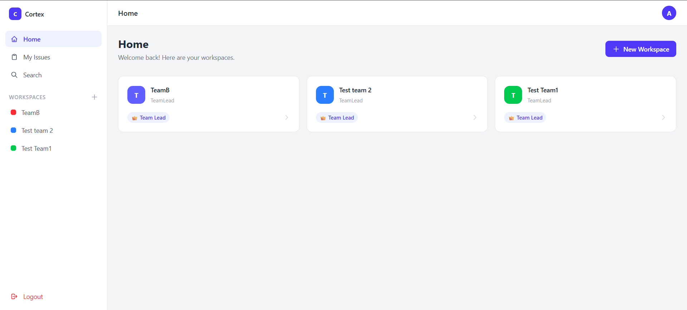
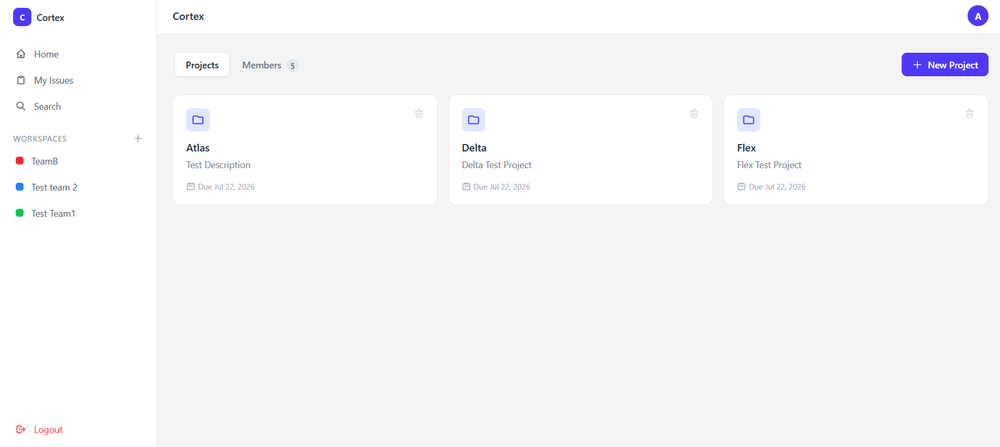
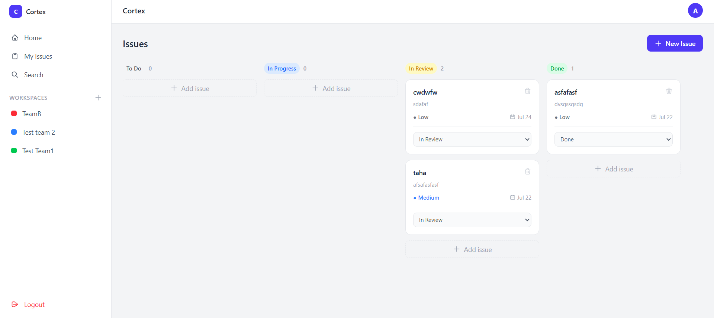
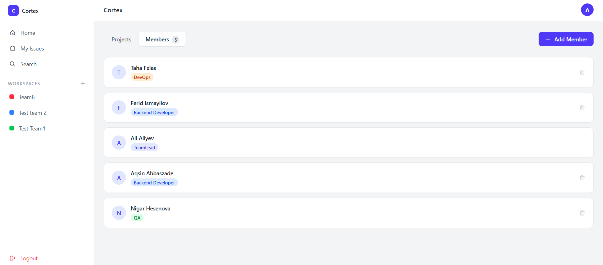

<div align="center">

# 🧠 Cortex

### A full-stack project management platform, built from scratch — Jira & Linear inspired.


**Workspaces • Roles • Projects • Kanban Issues — with real, workspace-scoped permissions.**

</div>

<br>



<br>

## ✨ What is Cortex?

Cortex is a workspace-based project management tool — think **Jira meets Linear**. Every team gets its own isolated **workspace**: its own members, its own projects, its own issues. The same person can be a `TeamLead` in one workspace and a plain `Backend Developer` in another — because a job title only ever means something *inside a specific team*.

Built 100% from scratch, end to end:
- 🏗️ A **modular monolith** backend in .NET 10
- ⚛️ A **React + TypeScript** frontend
- 🔐 Real **JWT authentication** and **role-based authorization**
- 📋 A working **Kanban board** where permissions actually matter

> 🎓 This was built as a hands-on learning project — going deep on Clean Architecture, CQRS, and authorization design in .NET, while picking up React from a backend-first starting point.

<br>

## 🚀 Features

### 🔑 Authentication
- Register & login with ASP.NET Core Identity
- Stateless JWT authentication
- Profile editing — update your name, change your password

### 🗂️ Workspaces
- Spin up a workspace in seconds — you're automatically its **TeamLead**
- Search teammates by email and invite them with a specific role
- Remove members or delete the whole workspace (TeamLead only)
- Belong to as many workspaces as you want, with a different hat in each one

### 🎭 Roles
- 15 ready-to-use job roles seeded out of the box:
  `TeamLead` `Backend Developer` `Frontend Developer` `Full Stack Developer` `Mobile Developer` `QA` `DevOps` `BA` `UI/UX Designer` `Graphic Designer` `Web Designer` `Marketing Specialist` `Product Manager` `Data Analyst` `Security Engineer`
- Roles are **workspace-scoped**, never global — permission checks always ask *"what's your role here?"*, not *"what's your role, period?"*

### 📁 Projects
- Full CRUD, gated to TeamLead for writes
- Every workspace member can browse all projects in their team

### ✅ Issues
- Create issues with priority, due date, and an assignee
- A real **Kanban board**: `To Do → In Progress → In Review → Done`
- Status changes are permission-checked, not just cosmetic:
  - TeamLead → can move anything, anywhere
  - Assignee → can update the status of *their own* issue only
- Regular members only ever see **their own** issues — TeamLead sees it all
- A cross-workspace **"My Issues"** view with a slick slide-in detail drawer

<br>

## 🛠️ Tech Stack

<table>
<tr>
<td valign="top" width="50%">

**Backend**
| | |
|---|---|
| 🟣 .NET 10 / ASP.NET Core | Web API |
| 🗄️ Entity Framework Core | ORM & migrations |
| 💾 SQL Server | Database (one per module) |
| 🪪 ASP.NET Core Identity | User management |
| 🔐 JWT Bearer | Stateless auth |
| 📨 MediatR | CQRS commands/queries |
| 📘 Scalar | Interactive API docs |

</td>
<td valign="top" width="50%">

**Frontend**
| | |
|---|---|
| ⚛️ React 19 | UI library |
| 🔷 TypeScript | Type safety |
| ⚡ Vite | Build tool |
| 🧭 React Router | Client-side routing |
| 🎨 Tailwind CSS | Styling |

</td>
</tr>
</table>

<br>

## 🏛️ Architecture

Cortex is a **Modular Monolith** — one deployable API, but every domain lives in its own fully isolated slice:

```
Cortex.Module.{ModuleName}.Domain          🧬 Entities, enums, core rules
Cortex.Module.{ModuleName}.Application     🧠 Use cases (CQRS commands/queries)
Cortex.Module.{ModuleName}.Infrastructure  🔧 EF Core, repositories, DI
```

**Why it's built this way:**

- 🧱 **Two databases, zero shared tables.** `Auth` and `Issues` each own their own `DbContext` and database. Neither ever queries the other's tables directly.
- 🔗 **No cross-module foreign keys.** A `WorkSpaceMember.UserId` is just a string pointing at `AppUser.Id` — resolved in application code, not enforced by SQL. This keeps the door open to splitting modules into real microservices later.
- 🎯 **Dependency Inversion, for real.** The Application layer only knows about interfaces it defines itself (`IWorkspaceRepository`, `IIdentityService`...). Infrastructure implements them. Business logic has never heard of EF Core.
- 🪶 **Thin controllers.** Every write flows through a MediatR command whose handler does both the authorization check *and* the persistence — controllers just forward the request.

```
Request → Controller → MediatR Command/Query → Handler → Repository → DbContext → SQL Server
```

<br>

## 📸 Screenshots

<table>
<tr>
<td width="50%">

**🏠 Home**
Every workspace you belong to, with your role in each.


</td>
<td width="50%">

**📁 Projects**
All the projects living inside a workspace.



</td>
</tr>
<tr>
<td width="50%">

**📋 Kanban Board**
Issues by status, with permission-aware inline updates.



</td>
<td width="50%">

**👥 Members**
Who's on the team, and what they do.



</td>
</tr>
</table>

<br>

## 🔐 Roles & Permissions

Roles are **workspace-scoped** — the same human can be a `TeamLead` here and a `Backend Developer` there. Every permission check happens in the handler, based on *"who is this person, in this workspace, right now."*

| Action | 👑 TeamLead | 🙋 Assignee | 👤 Other Members |
|---|:---:|:---:|:---:|
| Create workspace | ✅ *(anyone can)* | — | — |
| Add / remove members | ✅ | ❌ | ❌ |
| Delete workspace | ✅ | ❌ | ❌ |
| Create / update / delete project | ✅ | ❌ | ❌ |
| View projects | ✅ | ✅ | ✅ |
| Create / delete issue | ✅ | ❌ | ❌ |
| Assign / reassign issue | ✅ | ❌ | ❌ |
| Change issue status | ✅ *(any)* | ✅ *(own issue)* | ❌ |
| View issues | ✅ *(all)* | ✅ *(own only)* | ✅ *(own only)* |

<br>

## 📂 Project Structure

```
Cortex/
├── src/
│   ├── Cortex.Api/                          🚪 API host — controllers, Program.cs
│   ├── BuildingBlocks/                      🧰 Shared cross-cutting code
│   └── Modules/
│       ├── Cortex.Module.Auth/
│       │   ├── Cortex.Module.Auth.Domain/
│       │   ├── Cortex.Module.Auth.Application/
│       │   └── Cortex.Module.Auth.Infrastructure/
│       └── Cortex.Module.Issues/
│           ├── Cortex.Module.Issues.Domain/
│           ├── Cortex.Module.Issues.Application/
│           └── Cortex.Module.Issues.Infrastructure/
├── CortexUI/                                🎨 React + TypeScript frontend
│   └── src/
│       ├── pages/                           📄 Route-level pages
│       ├── components/                      🧩 Shared UI (Layout, etc.)
│       ├── context/                         🌐 React Context
│       └── services/                        📡 API client (JWT-aware fetch)
└── Cortex.slnx
```

<br>

## ⚡ Getting Started

### Prerequisites
`.NET 10 SDK` · `Node.js 18+` · `SQL Server`

### 1️⃣ Backend

```bash
cd Cortex
dotnet restore
dotnet build

# Apply migrations for both modules
dotnet ef database update --context AuthDbContext --project src/Modules/Cortex.Module.Auth/Cortex.Module.Auth.Infrastructure --startup-project src/Cortex.Api
dotnet ef database update --context IssuesDbContext --project src/Modules/Cortex.Module.Issues/Cortex.Module.Issues.Infrastructure --startup-project src/Cortex.Api

dotnet run --project src/Cortex.Api
```

Set your own values in `src/Cortex.Api/appsettings.json` first:

```json
{
  "ConnectionStrings": {
    "AuthModuleConnection": "Server=.;Database=CortexAuthDb;Trusted_Connection=True;TrustServerCertificate=True;",
    "IssuesModuleConnection": "Server=.;Database=CortexIssuesDb;Trusted_Connection=True;TrustServerCertificate=True;"
  },
  "Jwt": {
    "Key": "your-32+-character-secret-key",
    "Issuer": "CortexApi",
    "Audience": "CortexApiUsers",
    "ExpireMinutes": 60
  }
}
```

🌐 API → `https://localhost:7180`
📘 Interactive docs → `https://localhost:7180/scalar/v1`

### 2️⃣ Frontend

```bash
cd CortexUI
npm install
npm run dev
```

🌐 App → `http://localhost:5173`

<br>

## 📡 API Overview

| Method | Endpoint | Description | Access |
|---|---|---|---|
| `POST` | `/api/auth/register` | Create an account | Public |
| `POST` | `/api/auth/login` | Log in, get a JWT | Public |
| `GET` | `/api/auth/me` | Current user's profile | 🔒 |
| `PUT` | `/api/auth/profile` | Update name | 🔒 |
| `PUT` | `/api/auth/change-password` | Change password | 🔒 |
| `GET` | `/api/auth/users/search?email=` | Find a user by email | 🔒 |
| `POST` | `/api/WorkSpaces/CreateWorkSpace` | Create a workspace | 🔒 |
| `GET` | `/api/WorkSpaces/GetAll` | List your workspaces | 🔒 |
| `GET` | `/api/WorkSpaces/GetMembers?workspaceId=` | List members | 🔒 |
| `POST` | `/api/WorkSpaces/Addmembers` | Add a member | 👑 |
| `DELETE` | `/api/WorkSpaces/members/{id}?workspaceId=` | Remove a member | 👑 |
| `DELETE` | `/api/WorkSpaces/{id}` | Delete a workspace | 👑 |
| `GET` | `/api/roles` | List all job roles | 🔒 |
| `POST` | `/api/projects` | Create a project | 👑 |
| `GET` | `/api/projects?workspaceId=` | List projects | 🔒 |
| `PUT` | `/api/projects/{id}` | Update a project | 👑 |
| `DELETE` | `/api/projects/{id}?workspaceId=` | Delete a project | 👑 |
| `POST` | `/api/issues` | Create an issue | 👑 |
| `GET` | `/api/issues?projectId=&workspaceId=` | List issues *(role-filtered)* | 🔒 |
| `PATCH` | `/api/issues/{id}/status` | Update status | 👑 / 🙋 |
| `PATCH` | `/api/issues/{id}/assign` | (Re)assign an issue | 👑 |
| `DELETE` | `/api/issues/{id}?workspaceId=` | Delete an issue | 👑 |

*🔒 = any authenticated workspace member · 👑 = TeamLead only · 🙋 = assignee only*

Full interactive docs live at `/scalar/v1` once the API is running.

<br>

## 🧩 Key Design Decisions

- **Workspace-scoped roles, not global Identity roles** — a job title only means something inside one team, so it lives on the `WorkSpaceMember` join entity, never on `AppUser` itself.
- **Seeded role catalog, not a role CRUD** — job titles are fixed and shipped via migration, the same way Jira gives you a fixed role set instead of letting everyone invent new ones on the fly.
- **Repository + Unit of Work** — added specifically so the Application layer never has to import EF Core. It talks to interfaces; Infrastructure does the SQL.
- **No FKs across modules** — Auth and Issues live in separate databases; cross-module references are just IDs, resolved in code.
- **Anyone can create a workspace, only its TeamLead can change it** — same trust model as Slack, Jira, and Linear: spinning up a workspace only affects your own space, so there's no need for a global gatekeeper.

<br>

## 🔭 Future Improvements

- 💬 Issue comments & activity history
- ⚡ Real-time updates with SignalR
- 🔍 Pagination & search across projects/issues
- 🌗 Dark mode
- 🧪 Automated tests (unit + integration)
- 🐳 Docker Compose for one-command local setup

<br>

<div align="center">

**Built from the ground up — one migration, one bug fix, and one "wait, why did we do it this way?" at a time.**

</div>
